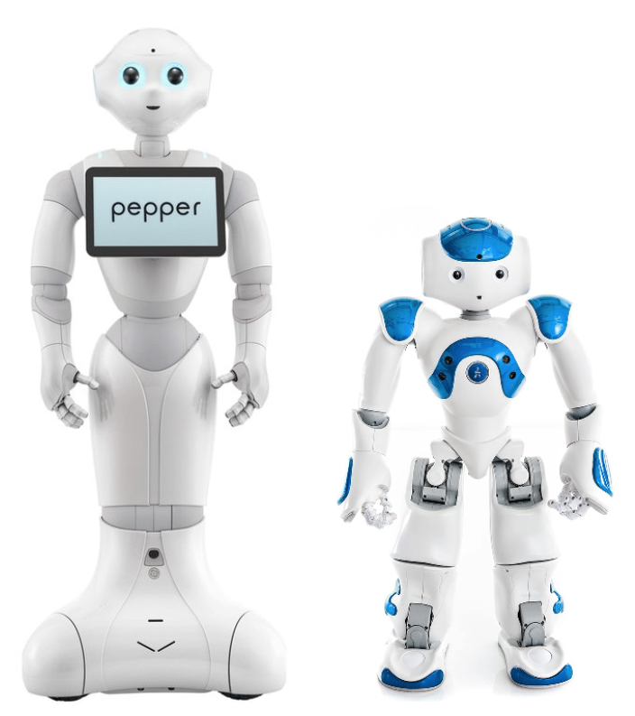

# Template

This repository is a template for CARES projects on GitHub

<p align="center">

</p>
<p align="center">
Pepper (Left) and NAO (Right)
</p>


## Description

Lorem ipsum dolor sit amet, consectetur adipiscing elit. Duis ac condimentum tellus. Quisque dignissim ante sapien. Duis ac nunc viverra, semper massa ut, sagittis nunc. Pellentesque tellus sem, tristique eget nibh sit amet, rhoncus varius quam. Class aptent taciti sociosqu ad litora torquent per conubia nostra, per inceptos himenaeos. Morbi venenatis nec magna ac fermentum. Pellentesque consequat interdum eros, at vulputate mi iaculis et. Duis ornare quis libero interdum ornare. Pellentesque tristique quis nulla et aliquet. Sed ultricies tristique felis, quis pretium ligula tincidunt quis. Maecenas et suscipit arcu, et finibus risus. Aliquam consequat blandit turpis ut molestie. Donec porta eros et finibus molestie. Vestibulum cursus gravida suscipit. Phasellus ac ipsum felis.

## Getting Started
### Dependencies

    
* Ubuntu 24.04 or Newer
* Conda
* Docker

### Installing
#### SDK
Clone the GitHub repo and install the requirements
```
git clone git@github.com:UoA-CARES/template.git
cd template
pip install -r requirements.txt
```
Download the SDK from the [Aldebaran](https://aldebaran.com/en/support/kb/nao6/downloads/nao6-software-downloads/) website (Alternatively from the [United Robotics Group](https://support.old.unitedrobotics.group/en/support/solutions/articles/80001024221-pepper-2-5-downloads) website). Once the SDK has downloaded, copy and paste it into the sdk folder and extract it.


## Executing Python program
Install the dependencies using the command
```
pip install -r py_requirements.txt
```

Run the Python program using the command
```
cd src
python main.py
```

## Executing Java program
Install the dependencies using the commands
```
cd src
mkdir -p lib
curl -L -o lib/junit.jar https://repo1.maven.org/maven2/junit/junit/4.13.2/junit-4.13.2.jar
curl -L -o lib/hamcrest.jar https://repo1.maven.org/maven2/org/hamcrest/hamcrest-core/1.3/hamcrest-core-1.3.jar
```
Build the Java program using the commands
```
javac -d build/classes -cp "lib/*" main/java/com/example/*.java
```

Run the Java program using the command
```
java -cp "build/classes:lib/*" com.example.Main
```

## Executing JavaScript program
Run the JavaScript program using the command
```
cd src
node main.js
```
## Executing C++ program
Run the C++ program using the command
```
cd src
mkdir build
cmake -S . -B build
cd build
./testing
```

# Package Structure

```text
template/
├─ package.json
├─ py_requirements.txt
├─ README.md
├─ media/
│  ├─ robots.png
├─ src/
│  ├─ __init__.py
│  ├─ main.py
│  ├─ CMakeLists.txt
│  ├─ main.cpp
│  ├─ main.h
│  ├─ main.js
│  ├─ main
│  │ ├─ java
│  │ │ ├─ com
│  │ │ │ ├─ example
│  │ │ │ │ ├─ Main.java
│  ├─ tests
│  │ ├─ main_test.py
│  │ ├─ main_test.cpp
│  │ ├─ main_test.js
│  │ ├─ java
│  │ │ ├─ com
│  │ │ │ ├─ example
│  │ │ │ │ ├─ MainTest.java
│  ├─ build
```

`src`: contains the source files and testing files
`media`: contains relevant images

## Notes

* Lorem ipsum dolor sit amet, consectetur adipiscing elit.


## Author

[Finn Tracey](finn.tracey@auckland.ac.nz)

## Version History
* 1.1
    * Added test cases and restructured file system
* 1.0
    * Initial Release
